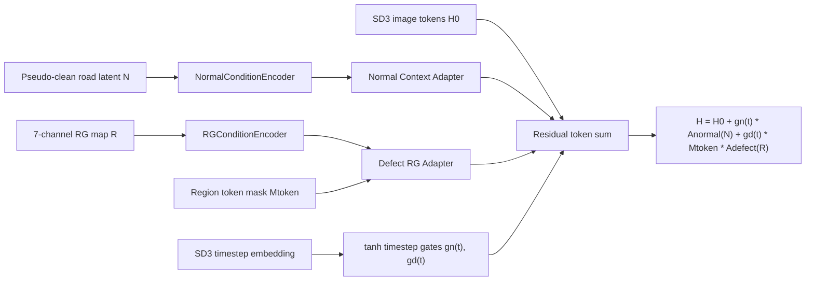

# SD3-RG Dual Adapter

SD3-RGDA (Stable Diffusion 3 Region-Guided Dual Adapter) is a clean-room CPU-testable scaffold for RDD2022/Czech road-damage generation. It maps RoadFusion's normal/anomaly dual-path idea into SD3 image-token residual adapters while reusing DIAG only as an external submodule and design reference.

This is not an official DIAG or RoadFusion reproduction. No SD3 weights, datasets, generated images, checkpoints, tokens, or server details are committed.



## Relationship To DIAG

DIAG is pinned as `third_party/DIAG` for audit and comparison only. `src/sd3_rgda/diag_bridge.py` independently converts DIAG-style prompt/mask metadata into local `GenerationCondition` records and manifests. It does not call DIAG private source code and does not depend on DIAG's original SDXL environment.

## Relationship To RoadFusion

`src/sd3_rgda/roadfusion_reference.py` is a clean-room reference head based on the paper-described dual adapters and patch discriminator. SD3-RGDA adapts the idea to SD3 token residuals rather than claiming line-by-line or official equivalence.

## RG Map

RDD2022 boxes are encoded into seven channels: union mask, bbox border, normalized in-box distance, D00, D10, D20, and D40. Maps are generated at image resolution, can be downsampled to latent resolution, and are patchified according to the actual SD3 transformer config.

## Install And CPU Tests

```powershell
cd E:\codex_project\road-damage-thesis-exp\tools\sd3_rg_dual_adapter
$env:PYTHONPATH="$PWD\src"
python -m compileall -q src scripts tests
python -m pytest tests -q
ruff check .
mypy src/sd3_rgda
```

## Future GPU Smoke

GPU smoke must use local SD3 files only, `local_files_only=True`, and must not download models. The first smoke should verify SD3 config field names, patch embedding module, image token shape, timestep passing, zero-init equivalence, and a micro-overfit before any formal generation run.

## Ablations

F0 disables RGDA, F1 uses one shared adapter, F2 uses only Defect RG Adapter, F3 uses Normal + Defect adapters, F4 adds timestep gates, and F5 optionally adds LoRA. Downstream comparison is B2 vs the existing B1 Czech + SD3 background-paste baseline.

## Known Limits

The current state is CPU/mock only. It does not load the 38.56 GB SD3 model, does not train, does not generate images, and does not validate real diffusers 0.33.1 module names on this machine.
